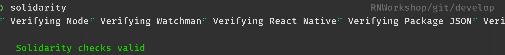
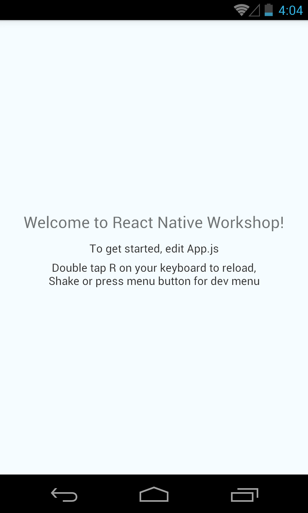

# React Native Workshop

## Persiapan

Silakan jalankan instruksi dibawah ini satu per satu.

0. Lakukan instalasi alat bantu android dan android sdk dengan mengikuti petunjuk [berikut](https://facebook.github.io/react-native/docs/getting-started). Pastikan menggunakan React Native CLI, bukan Expo CLI.

1. Clone repositori ini via terminal dengan perintah `git clone https://github.com/rizafahmi/RNWorkshop.git` atau `git clone git@github.com:rizafahmi/RNWorkshop.git`.
2. Masuk ke repositori hasil clone tadi via terminal `cd RNWorkshop`.
3. Lakukan instalasi pustaka-pustaka yang dibutuhkan via terminal dengan perintah `npm install`
4. Install pustaka [solidarity](https://github.com/infinitered/solidarity) dan plugin solidarity react-native dengan perintah `npm install -g solidarity solidarity-react-native`.
5. Jalankan solidarity via terminal dengan perintah `solidarity`. Pastikan semua _checklist_ berhasil dan tidak ada pesan kesalahan.

6. Jalankan JavaScript engine via terminal dengan perintah `npm start`.
7. Di terminal baru, jalankan perintah untuk menjalankan aplikasi mobile dengan perintah `react-native run-android`.
8. Pastikan di _device_ atau _emulator_ muncul seperti gambar berikut.

